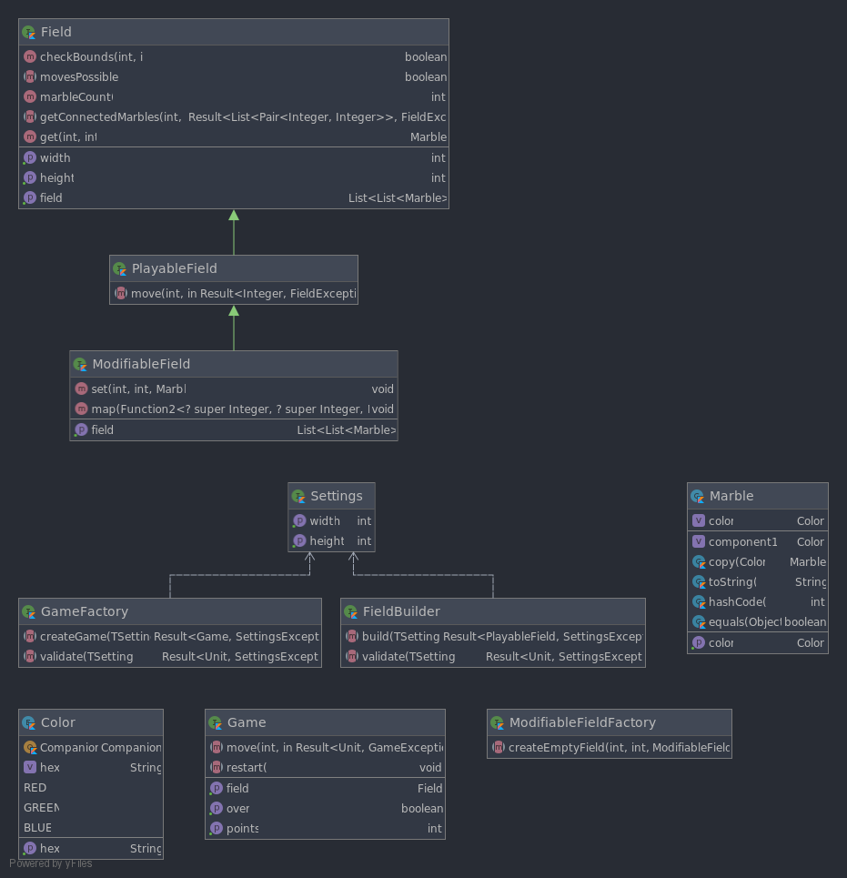
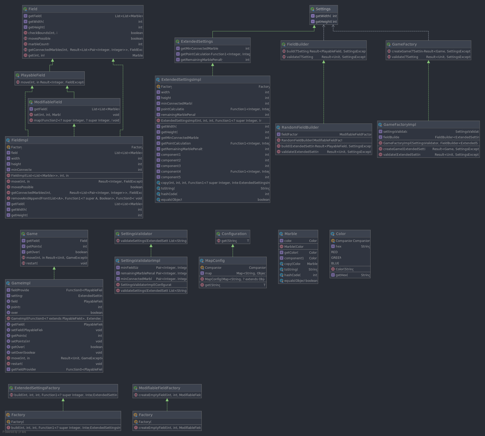

# Magic Marbles

## Setup

### Prerequisites

- JDK 8 installed & `JAVA_HOME` set

### Running

1. Navigate the root directory and run `.\gradlew.bat :ui:run` to start the application
2. Open the browser and navigate to `localhost:8080` to play the game
3. to change the port start the gradle task with `--args="-port=9090"`

## Implementation

The Magic-Marbles application consists of three modules.
The `core` module consisting of all the interfaces needed in the application.
The `core-impl` implements those interfaces. And the `ui` module provides a web-app to play the game.

The details of the architecture can be found in [Architecture](#architecture).

### Common Patterns

#### Abstract Factory

A commonly used pattern in the implementation is the _Abstract Factory_.
The creation of e.g. a `Game` instance or the field of a game is all done via factories. This allows it to replace the concrete implementation for the game/field without changing the using implementation.

#### Result Monad

Another commonly used "pattern" is the use of a `Result` Monad as return type. This means an operation either yield a successful result value or an error. For example the method to remove a marble on a field can return either the amount of marbles which where removed or the error which occurred.

With methods like `map` or `flatMap` the successful value of a `Result` can be used to do further operations.
The advantage of this is a sort of fail fast behaviour, meaning if the first operation fails the second one doesn't need to be executed.

#### Dependency Injection

Additionally all dependencies are injected via dependency injection. This allows for loose coupling between components.

### Used Libraries

- Frontend
  - Vue: SPA Framework
  - Vuex: State Management Library
- Backend
  - Result: Result Monad for Kotlin
  - KTOR: Web Server for Kotlin
  - kotlinx.serialization: Serializer for Kotlin
  - Kodein: Dependency Injection Framework

### Architecture

#### Core

The `core` module provides the interfaces as well as some data containers like `Color` and `Marble` for the magic marble game.
The two primary interfaces are `Game` which provides the operations to play the game and `Field` which models the field of the game. The `Field` interface is abstracted further and has two sub interfaces `PlayableField` and `ModifiableField`. The `ModifiableField` is only used for initializing the field and the `PlayableField` for playing.
The idea behind this is, that the creation and initialization of a field is encapsulated in the `FieldBuilder`, which prevents the user of a `FieldBuilder` to modify the field himself. Through the abstraction of the `ModifiableFieldFactory` the concrete implementation of the field in the `FieldBuilder` can be swapped out easily.

The `GameFactory` as well as the `FieldBuilder` can be parameterized via a `Settings` argument. To allow for better extension both `GameFactory` and `FieldBuilder` have a generic parameter which must extends from `Settings`. This makes it possible to pass additional `Settings`. This is used in the [Core-Impl](#core-impl) to pass `ExtendedSettings` to the factory.

#### Core-Impl

The `core-impl` module uses the interfaces defined in [Core](#core) and implements them.

 Furthermore it defines a `SettingsValidator` for validating Settings and providing error messages, as well as `Configuration` which is a container for various game settings. It is used for example by the `SettingsValidator` to check if the Settings are valid. This allows changing those parameters without changing the validation logic.

This module also provides `ExtendedSettings` and a factory `ExtendedSettingsFactory` for creating a object.
`ExtendedSettings` allow for customization on how many points should be removed per marble at the end of the game, how many marbles need to be connected to be able to be removed and how points should be calculated.

An interesting implementation detail is, that the `GameImpl` does not directly use a `FieldBuilder` to create a field. Rather the `GameFactory` checks if the Settings are valid for creating a `Field` via the `validate` method of the `FieldBuilder` and then passes a anonymous function to `GameImpl` which internally call the `build` method of the `FieldBuilder` and unwraps the `Result`. This way the `GameImpl` doesn't have to bother with the potential failure of the `FieldBuilder`.
Furthermore it is easier to restart the game since the `GameImpl` only has to call the lambda again to create a new field.

#### UI

The `ui` module basically only consists of the web API which handles requests, the `GameServer` which stores the state of all games and changes it accordingly, a few DTOs for exposing internal state to the API consumers and the frontend.

For the frontend the SPA-Framework Vue was used in combination with Vuex as state management library.
Through the UI the user can

- Start a game, by entering the desired settings
- Restart a game with the current configuration
- Start a new game during the currently running one with different settings
- Remove connected marbles
- Hover over marbles to see which are connected

The Frontend and web API communicate via HTTP calls. The API exposes four operations: `sync`, `startWithConfiguration`, `move` and `hover`. To identify the player in the API every player receives a session in form of a cookie.

`sync` is used to synchronize the game state at application start-up. For example if a player closes the browser window and opens it again the application will sync the last known state so the player can continue where he left off.

Furthermore the game uses a "syncing strategy" to prevent players from playing the game in an outdated state. For example the player plays the game and then opens a second browser window to continue the game there. To prevent the player from playing on an outdated state in the original window, each game state gets a unique id. If the player makes a move a new id is generated. This id gets exchanged between UI and API. If the player tries to make a move and provides an id that does not match the current saved state, he automatically receives the new state.

With `startWithConfiguration` the player can start a game with the given configuration. This configuration is validated, and any errors will be displayed in the configuration UI.

With `move` the player can remove connected marbles.

The `hover` method is used by the frontend to visualize which marbles are connected. It yields the coordinates of all connected marbles for a given marble.

### SOLID - Principles

The implementation uses all five solid principles heavily. In the following for every principle it is described how it was used in the implementation.

#### S - Single Responsibility Principle

The implementation strictly follows the single responsibility principle by separating concerns. An example of this is the split of the `Game` and `Field` where the `Game` is solely concerned with managing the game (checking if a game is over and how many points a player achieved) and the `Field` is only responsible for managing the field state.

#### O - Open-Closed Principle

The open-closed principle does not really find application in the magic marbles implementation since large inheritance hierarchies are avoided in general.

The only point where this would find application is in the translation from Exceptions to HTTP responses. But in this case i chose against it, since the exception should not know that it might be transformed to a HTTP message. Also implementing a different UI would not be possible.

#### L - Liskov Substitution Principle

The implementation of the magic marbles game also follows the liskov substitution principle since every class/interface can be replaced by its subclass/implementation. This is possible through careful interface definition, to prevent defining an interface a implementation would not conform to.

#### I - Interface Segregation Principle

The implementation also follows the interface segregation principle to not provide the client with an interface it will never use. A prime example is the split between `Field`, `PlayableField` and `ModifiableField`. With this split the implementation of a new field is much more flexible in comparison to a single `Field` interface.

#### D - Dependency Inversion Principle

The magic marbles game heavily adapts the dependency inversion principle by providing every dependency in form of an injected variable. This greatly decreases coupling and increases the adaptability of the system.
